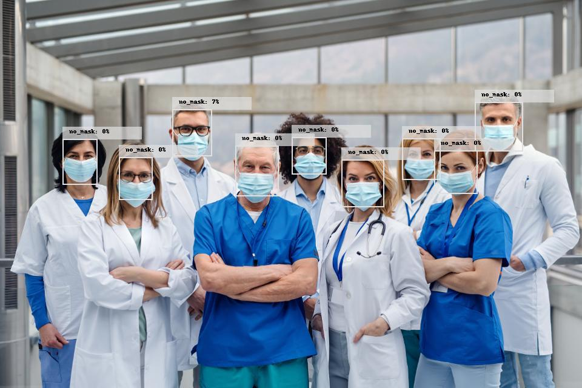

# PPE Mask Detector


_Image source: Getty Images_

[PPE Mask Detector]() - is a real-time computer vision model for identifying safety breaches and ensuring quality control policies in a laboratory or healthcare facilities. It is trained on the dataset manually selected and annotated by the VITechLab team. It works with live footage from CCTV cameras and detects people not wearing any of four objects: Coat, Glasses, Glove, Mask. The ML model can be used in schools and universities, industry, government, military facilities, and other laboratories where safety rules and regulations should be strictly followed. This AI-based pre-packed solution is available for a subscription now.

### Are you looking to kick off an ML-driven worker safety initiative at your enterprise? [Contact us](https://vitechlab.com/) for details — we're now looking for pilot project teams to test the solution and will be happy to cooperate.

## Usage Information

Using our model for real time prediction is as simple as this:

```python
predictor = sagemaker.predictor.RealTimePredictor(
    ' your endpoint name ',
    sagemaker_session=sagemaker.Session(),
    content_type="image/jpeg"
)

with open('data/sample_image.jpg', 'rb') as img:
    img_bytes = bytearray(img.read())
    result = predictor.predict(img_bytes).decode("utf-8")
```

Also we've published two notebooks showing how to use our model:
* [Using-PPE-Mask-Detector-Endpoint.ipynb](Using-PPE-Mask-Detector-Endpoint.ipynb) notebook shows how you can use Python API to perform inference on endpoint created from the model
* [Using-PPE-Mask-Detector-model.ipynb](Using-PPE-Mask-Detector-model.ipynb) notebook shows how you can use Python API to run the full scenario:
    * deploy our model to create an endpoint
    * run Real Time inference on endpoint using local image
    * visualize  and save the prediction on original image
    * run Batch Transform job to perform the inference on your data stored in Amazon S3 bucket

## Input\output data examples

* You can find sample input data in [demo_input](sample_data/demo_input) folder
* [demo_output_images](sample_data/demo_output_images) folder contains images with detections predicted by the model and visualized using `utils.visualize_detection` method
* [demo_raw_output](sample_data/demo_raw_output) folder contains raw output generated by our model using `Batch Transform` approach


